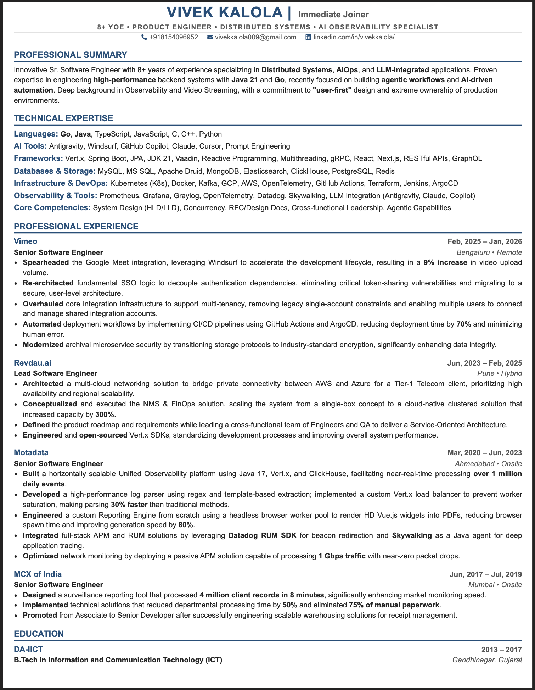
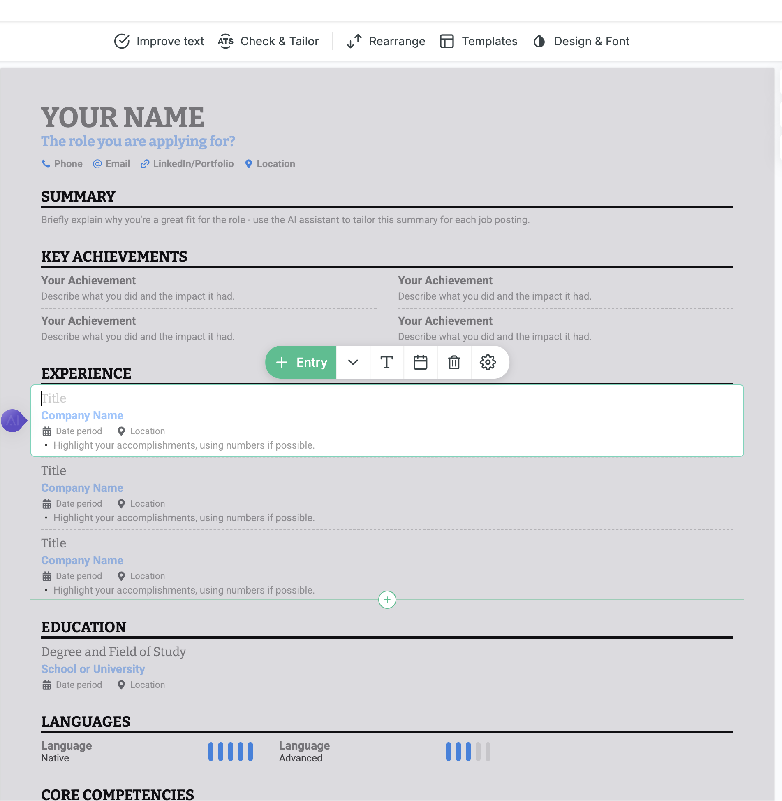

# Requirements and Technical Specifications

# Overview
This is a resume builder application that allows users to create and manage their resumes.

# Pages
Home or landing page is a list of tools by the omega intellignce and one of the product is Resume-Builder. (later we will add more products). all products should be displayed as a tile with title description and a relvant image of product. clicking the product/tile will open the product in same page. 

# Product: resume builder 
Refer to  as wireframe for the frontend ui of the resume builder.

## Features
- User authentication
- Resume management: multiple resumes can be created by a user. (only 1 resume can be marked as primary)
- Resume builder/viewer/editor/exporter: 
    - i want as single page. it will open up A4 page like pdf (refer to ). by look it looks like a plainpdf file
    - on hover of a component it will show that it's editable (by a border). 
    - upon clicking on it it should allow to edit that component text (refer to )
    - the modal/dialogue should update the main resume content in real time
    - there should be buttons to add new components for example experience, skills, education etc.
    - there should be buttons to delete components (for example delete an experience)
    - there should be buttons to move components up or down (for example move an experience up or down)
    - there should be a button to preview the resume (this will open a modal to preview the resume)
    - there should be a button to export the resume (this will open a modal to export the resume as pdf)

# Phase 1: UI
implement UI to enable these things. these will not store the data in backend. it will just save it in local storage (it will be lost on refresh. as this phase is only UI phase)